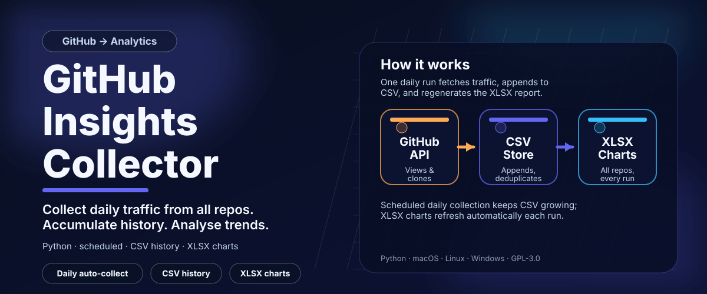

# GitHub Insights Traffic Collector



A lightweight tool
(views and clones) for all your owned repositories and stores it in a
local CSV file that accumulates indefinitely.

After each collection run a two-sheet XLSX workbook is regenerated
automatically so the charts are always current when you open the file.

## How it works

### Data collection (`collect_insights.py`)

The GitHub Traffic API exposes up to 14 days of history per request.
Running the collector daily ensures a continuous, gap-free historical
record.

On each run the script:
1. Authenticates with your GitHub token
2. Queries every owned repository for daily views and clones
3. Loads the existing CSV and skips records that are already present
4. Appends only new rows, sorted chronologically
5. Regenerates the XLSX report (unless `auto_report = false` in config)

The CSV file is named `insights-traffic-<github-username>.csv` and is
placed in the configured output directory (`~/Documents/GitHubInsights/`
by default).

### Report workbook (`generate_report.py`)

Produces `insights-traffic-<username>.xlsx` alongside the CSV.
The workbook has exactly two sheets:

| Sheet | Content |
|---|---|
| `Data` | Pivot tables for the chart window (last N months): one row per date, one column per repository, repeated for each of the four metrics. All-time totals per repository at the bottom. This is the sole data source that all charts reference. |
| `Charts` | Six compact charts in a 2-column grid — no tables. All charts are linked directly to the Data sheet. |

Chart layout:

| Left | Right |
|---|---|
| Daily Views | Daily Unique Visitors |
| Daily Clones | Daily Unique Cloners |
| All-time Views (bar) | All-time Clones (bar) |

## File overview

| File | Description |
|---|---|
| `collect_insights.py` | Main data collection script (stdlib only) |
| `generate_report.py` | XLSX report generator (requires openpyxl) |
| `config.toml` | Configuration — token path and output directory |
| `requirements.txt` | Python package dependencies (`openpyxl`) |
| `install-mac.sh` | macOS installer (launchd LaunchAgent) |
| `uninstall-mac.sh` | macOS uninstaller |
| `install-linux.sh` | Linux installer (systemd user timer) |
| `uninstall-linux.sh` | Linux uninstaller |
| `install-windows.ps1` | Windows installer (Task Scheduler) |
| `uninstall-windows.ps1` | Windows uninstaller |

## Installation

### macOS

```bash
chmod +x install-mac.sh
./install-mac.sh
```

Optional arguments:

```bash
./install-mac.sh --hour 9 --minute 30          # schedule at 09:30
./install-mac.sh --output-dir ~/MyData          # custom output directory
```

The installer places files in
`~/Library/Application Support/insights-traffic-collector/`
and registers a launchd LaunchAgent in `~/Library/LaunchAgents/`.
No root access is required.

### Linux

```bash
chmod +x install-linux.sh
./install-linux.sh
```

Optional arguments work the same as the macOS installer.

Files are installed to `~/.local/share/insights-traffic-collector/`.
A systemd user service + timer are registered and enabled automatically.
On headless servers, enable lingering so the timer persists after logout:

```bash
sudo loginctl enable-linger "$(id -un)"
```

### Windows

Open PowerShell and run:

```powershell
.\install-windows.ps1
```

Optional arguments:

```powershell
.\install-windows.ps1 -Hour 9 -Minute 30
.\install-windows.ps1 -OutputDir "D:\MyData"
```

Files are installed to `%LOCALAPPDATA%\insights-traffic-collector\`.
A Task Scheduler task is registered and configured to run daily.
No administrator privileges are required.

## Configuration

Edit `config.toml` in the install directory after installation:

```toml
[github]
# Path to a file containing your GitHub personal access token.
# The token must have the 'repo' scope to read traffic data.
# Create one at: https://github.com/settings/tokens
token_file = "~/.github-token"
# Alternative: set the GITHUB_TOKEN environment variable (highest priority).

[output]
# Directory where the CSV and XLSX files will be stored.
directory = "~/Documents/GitHubInsights"

[chart]
# Number of calendar months to show in the time-series charts.
# The Data sheet contains only this many months of pivoted data.
# All-time totals in the Summary block are unaffected.
months = 6

# Set to false to skip automatic XLSX generation after each collection run.
# When false, run generate_report.py manually whenever you need a fresh report.
auto_report = true
```

You can also supply the token via the `GITHUB_TOKEN` environment variable,
which takes priority over the config file.

## Running manually

**Collect data and regenerate the report immediately (macOS/Linux):**

```bash
# Using the installed venv
"$HOME/Library/Application Support/insights-traffic-collector/venv/bin/python3" \
    "$HOME/Library/Application Support/insights-traffic-collector/collect_insights.py"

# From the source directory with system Python
python3 collect_insights.py
```

**Generate a fresh report without collecting new data:**

```bash
python3 generate_report.py
```

The XLSX is saved next to the CSV with the same base name (`.xlsx` extension).

**Override the chart window on the fly:**

```bash
python3 generate_report.py --months 3    # show only the last 3 months
```

**Custom paths:**

```bash
python3 collect_insights.py  --config /path/to/config.toml --output-dir /path/to/data
python3 generate_report.py   --csv /path/to/data.csv --output /path/to/report.xlsx
```

## Viewing logs

| Platform | Command |
|---|---|
| macOS | `tail -f ~/Library/Logs/insights-traffic-collector.log` |
| Linux | `journalctl --user -u insights-traffic-collector.service -f` |
| Windows | `Get-Content "$env:LOCALAPPDATA\insights-traffic-collector\insights-traffic-collector.log" -Wait` |

## Changing the schedule

Re-run the installer with `--hour` / `--minute` arguments.
The installer is safe to run multiple times — it replaces the daemon
configuration and preserves your existing `config.toml`.

```bash
./install-mac.sh --hour 6 --minute 0    # change to 06:00
```

## Uninstallation

```bash
./uninstall-mac.sh       # macOS
./uninstall-linux.sh     # Linux
.\uninstall-windows.ps1  # Windows (PowerShell)
```

The uninstallers remove the daemon, the install directory, and the venv.
Your CSV and XLSX data files are **not** deleted.

## Requirements

- Python 3.11 or higher
- `openpyxl` 3.0+ (installed automatically into the venv by the installer)
- A GitHub personal access token with the **`repo`** scope
  (create one at <https://github.com/settings/tokens>)
- Network access to `api.github.com`

## License

GNU General Public License v3 — see [LICENSE](LICENSE).
